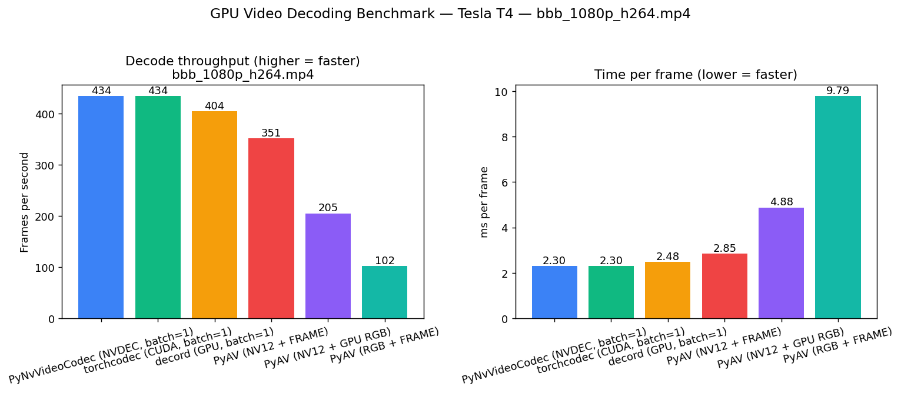

# GPU Video Decoding Benchmark

Comparison of three Python libraries for decoding video on the GPU, all on the **latest FFmpeg they support**:
[torchcodec](https://github.com/meta-pytorch/torchcodec),
[PyAV](https://github.com/pyav-org/pyav) with `hwaccel=cuda`,
[PyNvVideoCodec](https://developer.nvidia.com/video-codec-sdk) (the official NVIDIA Video Codec SDK wrapper).

> **decord lives in a sibling project** — [`../decord_gpu_test`](../decord_gpu_test) — because it is the only library here that does not work with FFmpeg ≥ 5. Pinning it to FFmpeg 4.4 in its own environment keeps this project free to use the latest FFmpeg for everything else.

---

## 1. Results

Video: **Big Buck Bunny 1080p H.264, 2100 frames @ 30 fps (~70 s), ~24 Mbps**
GPU: **Tesla T4** (NVDEC)
Metric: median across 3 runs after 1 warmup. Every frame is "touched" via `tensor.sum()` to guarantee materialization.

| Rank | Library | FPS ↑ | ms/frame ↓ | Peak GPU mem (torch-alloc) |
|:-:|---|---:|---:|---:|
| 🥇 | **PyNvVideoCodec** (NVDEC, batch=2) | **1079** | 0.93 | 32 MB |
| 🥈 | torchcodec (CUDA, batch=2) | 1001 | 1.00 | 107 MB |
| 🥉 | PyAV (NV12 + FRAME) | 354 | 2.83 | 27 MB |
| 4 | PyAV (NV12 → GPU RGB) | 204 | 4.89 | 99 MB |
| 5 | PyAV (RGB + FRAME) | 101 | 9.86 | 54 MB |

For the decord numbers (~877 fps, ~95 MB at batch=2), see the [`decord_gpu_test`](../decord_gpu_test) project.



### Interpretation

- **PyNvVideoCodec** is the reference for both speed and memory. It talks directly to NVDEC and leaves frames in NV12 on the GPU, so there is no color-conversion overhead in this test.
- **torchcodec** is tightly bound by batch size when running on the GPU.
    - At `batch_size=32` it reserves **>1.5 GB** of GPU RAM (≈53 MB per frame in the requested range).
    - Reducing to `batch_size=2` cuts memory **15×** (down to ~100 MB) without any throughput loss — slightly faster, in fact.
    - The decoder cache is also capped via `set_nvdec_cache_capacity(1)`.
- **PyAV** has three flavors, all using `hwaccel=cuda`:
    - **RGB + FRAME** is the slowest (101 fps): NVDEC decodes on GPU, the frame is copied back to the CPU, and `to_ndarray("rgb24")` runs an expensive scalar YUV→RGB conversion in libswscale.
    - **NV12 + FRAME** (354 fps) drops the RGB conversion and just hands back NV12 (Y plane + interleaved UV). Best PyAV variant when downstream code can consume NV12.
    - **NV12 → GPU RGB** (204 fps) decodes to NV12, uploads to the GPU, and runs a small BT.601 conversion kernel in PyTorch. Faster than CPU RGB but slower than NV12-only because the upload + matmul are not free.
- All PyAV paths still pay a GPU→CPU copy because PyAV does not expose the CUDA frame pointer. A "true GPU" pipeline cannot use PyAV for this reason.

---

## 2. Environment

| Component | Version | FFmpeg used |
|---|---|---|
| OS | Ubuntu (kernel 6.14) | — |
| GPU | Tesla T4 (compute capability 7.5) | — |
| NVIDIA driver | 575.57.08 | — |
| CUDA toolkit | 12.6 | — |
| Python | 3.12 (conda env `video`) | — |
| torch | 2.11.0+cu126 | — |
| torchcodec | 0.11.1+cu126 | system FFmpeg (probes 4–8, picks the highest installed) |
| PyAV | 17.0.1 | **bundled** in the wheel (FFmpeg 7.x) |
| PyNvVideoCodec | 2.1.0 | bundled stub demuxer (FFmpeg only used for container parsing) |
| System FFmpeg | **7.1.x** (libavutil.so.59) | — |

**Why these versions are "the latest each library supports":**
- **PyAV 17.x** ships its own FFmpeg 7 inside the wheel — system FFmpeg version is irrelevant for it.
- **torchcodec 0.11** runtime-probes `libavutil.so.{60,59,58,57,56}` in order; with FFmpeg 7 (`.so.59`) installed it loads that. The "not found" log lines for `.so.60` are normal probes, not errors.
- **PyNvVideoCodec** uses FFmpeg only to parse the container — any modern version works.

---

## 3. Reproducing from scratch

This section assumes a fresh Ubuntu machine with an NVIDIA GPU. The order matters: system pieces (driver, CUDA, FFmpeg headers) have to be in place before any pip wheel will work.

### 3.1 System prerequisites

```bash
# NVIDIA driver — verify it sees the GPU
nvidia-smi

# CUDA toolkit (provides nvcc; not strictly needed at runtime since wheels bundle CUDA libs)
sudo apt-get install -y cuda-toolkit-12-6 || \
    echo "Install CUDA from https://developer.nvidia.com/cuda-downloads"

# Build tools
sudo apt-get install -y build-essential git curl
```

### 3.2 System FFmpeg (latest = 7.x)

Ubuntu 24.04 ships FFmpeg 6 in its main repo; for FFmpeg 7 use the official static builds or a PPA:

```bash
# Option A: official static build (no system pollution)
curl -L -o /tmp/ffmpeg.tar.xz \
  https://johnvansickle.com/ffmpeg/releases/ffmpeg-release-amd64-static.tar.xz
mkdir -p /tmp/ffmpeg && tar -xf /tmp/ffmpeg.tar.xz -C /tmp/ffmpeg --strip-components=1
sudo install -m 0755 /tmp/ffmpeg/ffmpeg /tmp/ffmpeg/ffprobe /usr/local/bin/

# Option B: dev headers + .so via PPA (if you want torchcodec to dynamically link)
sudo add-apt-repository -y ppa:ubuntuhandbook1/ffmpeg7
sudo apt-get update
sudo apt-get install -y ffmpeg \
    libavcodec-dev libavformat-dev libavfilter-dev \
    libavutil-dev libavdevice-dev

ffmpeg -version | head -1
# → ffmpeg version 7.1.x ...
```

Use **Option B** if you want torchcodec to use system FFmpeg 7. With Option A only the binaries are in place; torchcodec will fall back to whatever `libav*.so` the system has.

### 3.3 Conda environment

```bash
# install miniconda first if needed:
#   curl -L -o /tmp/mc.sh https://repo.anaconda.com/miniconda/Miniconda3-latest-Linux-x86_64.sh
#   bash /tmp/mc.sh -b -p $HOME/miniconda3 && eval "$($HOME/miniconda3/bin/conda shell.bash hook)"

conda create -n video python=3.12 -y
conda activate video
pip install --upgrade pip
```

### 3.4 PyTorch + torchcodec (CUDA wheels)

torchcodec 0.11.x requires torch ≥ 2.7. Install both from the PyTorch CUDA-12.6 wheel index:

```bash
pip install --upgrade torch --index-url https://download.pytorch.org/whl/cu126

# torchcodec built against the same CUDA. --no-deps so it doesn't drag a different torch in.
pip install --force-reinstall --no-deps torchcodec --index-url https://download.pytorch.org/whl/cu126
```

Sanity check:
```bash
python -c "
import torch, torchcodec
from torchcodec.decoders import VideoDecoder
print(torch.__version__, torch.cuda.get_device_name(0))
print('torchcodec:', torchcodec.__version__)
"
```

### 3.5 PyAV and PyNvVideoCodec (pure pip)

Both ship working wheels — no source build needed. **PyAV bundles its own FFmpeg 7 inside the wheel**, so it does not collide with anything on the system, and it always uses the latest FFmpeg the PyAV release was built against.

```bash
pip install av PyNvVideoCodec matplotlib pandas numpy
```

Sanity check:
```bash
python -c "
import av, PyNvVideoCodec as nvc
print('PyAV:', av.__version__,
      ' bundled libavutil:', av.library_versions['libavutil'])
print('PyNvVideoCodec:', nvc.__version__)
"
```

### 3.6 Test video

```bash
mkdir -p data results
curl -sL -o data/bbb_1080p_h264.mp4 \
  "https://test-videos.co.uk/vids/bigbuckbunny/mp4/h264/1080/Big_Buck_Bunny_1080_10s_30MB.mp4"
ffprobe -v error -select_streams v:0 \
  -show_entries stream=codec_name,width,height,nb_frames,r_frame_rate \
  -of default=nw=1 data/bbb_1080p_h264.mp4
```

For the longer 70 s / 2100-frame variant used to generate the results above, concatenate the clip with itself 7 times via `ffmpeg -f concat`.

### 3.7 Run the benchmark

```bash
conda activate video
python src/benchmark.py data/bbb_1080p_h264.mp4
# any other video file works too:
python src/benchmark.py /path/to/my_video.mp4 --runs 5 --warmup 2
```

Artifacts:
- `results/benchmark.png` — three bar charts (FPS, ms/frame, peak GPU mem)
- `results/benchmark.csv` — raw numbers per library

---

## 4. Build/runtime errors and fixes

### 4.1 `torchcodec`: `undefined symbol: aoti_torch_abi_version`
The `torchcodec 0.11.1` wheel needs `torch >= 2.7`; on top of `torch 2.5+cu121` it fails to load `libtorchcodec_core6.so`. Fix by upgrading torch:
```bash
pip install --upgrade torch --index-url https://download.pytorch.org/whl/cu126
pip install --force-reinstall --no-deps torchcodec --index-url https://download.pytorch.org/whl/cu126
```

### 4.2 `torchcodec`: `libavutil.so.60/58/57/56 not found`
torchcodec probes FFmpeg versions 4–8 in order. With FFmpeg 7 installed it loads `libavutil.so.59` — the other "not found" lines in the traceback are probes, not real errors.

### 4.3 `PyNvVideoCodec`: `SimpleDecoder has no attribute 'stop'`
The 2.1.0 binding does not export `.stop()` on `SimpleDecoder` (the docs mention it). Just `del dec`.

### 4.4 `PyNvVideoCodec.CreateSimpleDecoder(...)` raises `TypeError`
The factory in 2.1.0 is broken — use the class directly:
```python
import PyNvVideoCodec as nvc
dec = nvc.SimpleDecoder(path)
md  = dec.get_stream_metadata()
batch = dec.get_batch_frames(32)            # list[DecodedFrame]
t = torch.as_tensor(batch[0], device="cuda") # via __cuda_array_interface__
```

---

## 5. Benchmark architecture

`src/benchmark.py` is a single file; each library is isolated in its own `bench_*` function.
Common pattern:

1. `torch.cuda.empty_cache()` + `reset_peak_memory_stats()`.
2. Create the decoder.
3. Decode loop (batched in 2s where applicable).
4. "Touch" the frame via `tensor.sum()` — defeats lazy execution.
5. `torch.cuda.synchronize()` before stopping the timer.
6. Read `torch.cuda.max_memory_allocated()`.

Repeated 3 times (after 1 warmup) → median.

**Caveats / honest comparison:**
- PyNvVideoCodec keeps frames in NV12 (YUV); the other GPU paths return RGB. NVDEC has a fairness advantage on conversion (torchcodec does it; PyNvVideoCodec does not in this test). The PyAV "NV12 → GPU RGB" variant exists to give a more apples-to-apples NVDEC-style comparison.
- `peak_gpu_mem_mb` is measured via the **torch allocator** — frames living in CUDA memory outside torch (e.g. NV12 buffers from PyNv) are not counted; real PyNv usage is higher than 32 MB (check `nvidia-smi` during the run).
- PyAV: `to_ndarray(format=...)` always triggers a D→H copy because PyAV does not expose the CUDA frame pointer. For a "pure GPU" pipeline PyAV is not a candidate.

---

## 6. Project layout

```
video_decoders_test/
├── data/
│   └── bbb_1080p_h264.mp4       # test video, 30 MB
├── src/
│   └── benchmark.py             # benchmark script (3 libs, no decord)
├── results/
│   ├── benchmark.png
│   └── benchmark.csv
├── REPORT.md                    # original Russian report (kept for history)
└── README.md                    # this file

../decord_gpu_test/              # sibling project — decord on FFmpeg 4.4
```

---

## 7. Next steps (not implemented)

- Compare on H.265 / HEVC and AV1 (NVDEC on T4 does not support AV1 — would be skipped).
- 4K video — interesting to see where bandwidth becomes the bottleneck first.
- Parallel decoders / multiple videos at once.
- DALI (`nvidia.dali`) as an additional candidate.
- Compare "raw" NVDEC throughput without RGB conversion across torchcodec pipelines.
